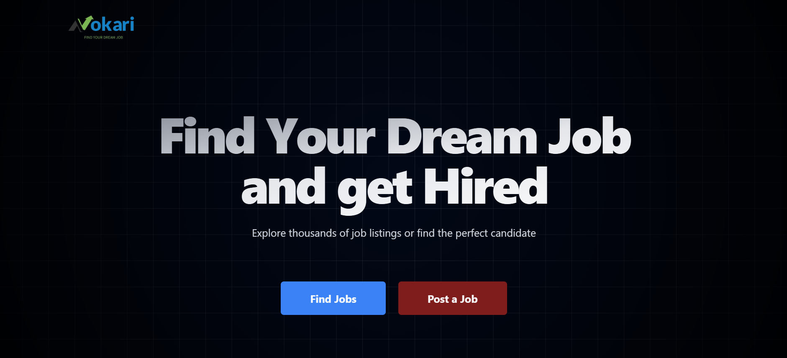
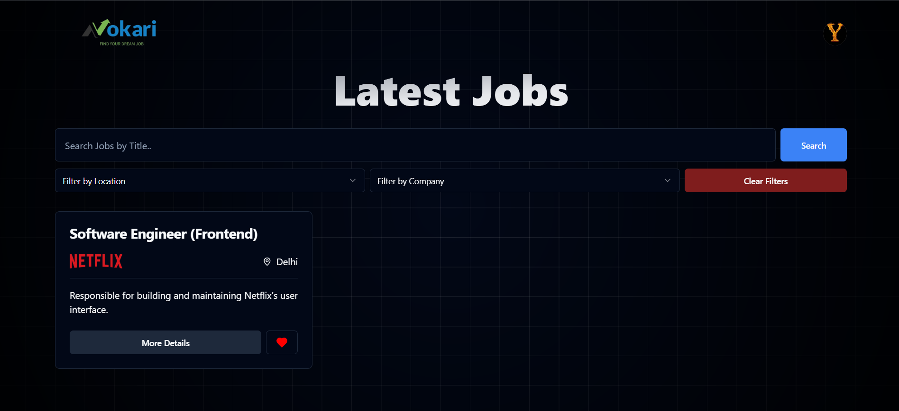

# 🚀 Nokari_Zhep | Online Job Portal Platform

**Nokari_Zhep** is a modern and user-friendly job portal web app built using **React + Tailwind CSS + Supabase**. It allows job seekers and recruiters to connect seamlessly, helping users find jobs or post opportunities with ease.






🔗 **Live Demo:** [https://nokari-zhep.vercel.app](https://nokari-zhep.vercel.app/)


## 🛠️ Tech Stack

- ⚛️ React.js (Frontend)
- ⚡ Vite (Build tool)
- 🎨 Tailwind CSS (Styling)
- 🌍 Vercel (Hosting)

---


## 🚀 Features

- Separate roles: **Recruiter** (post jobs, manage applications) & **Job Seeker** (browse jobs, apply, manage profile)  
- User authentication & role-based access  
- Job posting, editing and deletion by recruiters  
- Searching, filtering and applying for jobs by job seekers  
- Application management: recruiters can shortlist, reject or accept applicants  
- Profile management (upload resumes, update details)  
- Responsive UI for modern devices  


## 🧑‍💻 Getting Started

### Prerequisites

- Node.js (v14 or newer recommended)  
- npm or yarn  
- Supabase database 

To run this project locally:

1. **Clone the repo**
   ```bash
   git clone https://github.com/yogesh032003/Nokari_Zhep.git
   cd Nokari_Zhep
   npm install
   npm run dev
